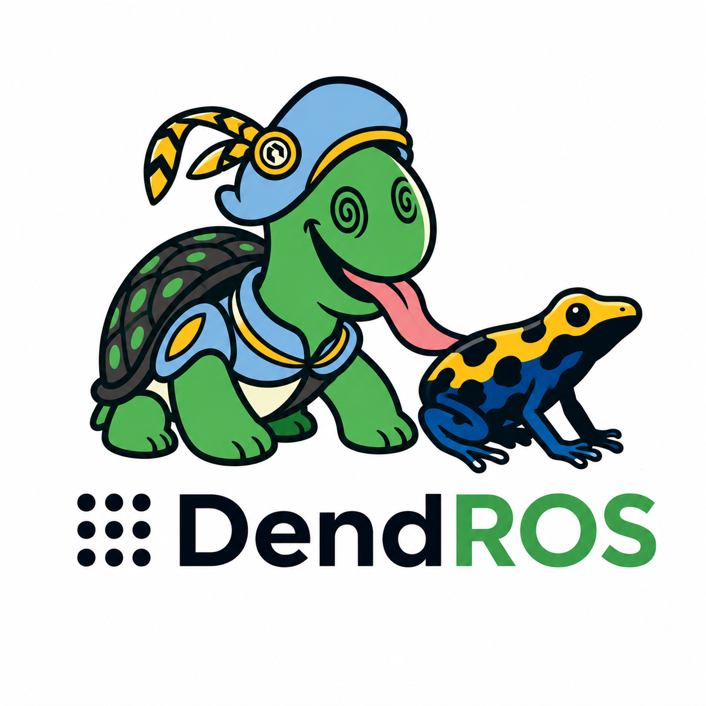

<p align="center">
  
</p>

<h1 align="center">DendROS</h1>
<p align="center">Colorized ROS 2 terminal output — assign colors to node groups without touching your launch files.</p>


```
[slam_toolbox-1]  [LOC]  [INFO] [...]: Serialization format: cdr
[bt_navigator-1]  [NAV]  [INFO] [...]: Creating BT navigator
[controller_server-1]  [NAV]  [WARN] [...]: Costmap is empty
[robot_state_publisher-1]  [HW]  [INFO] [...]: Robot description loaded
```

DendROS shadows the `ros2` command with a shell function. When you run `ros2 launch` or `ros2 run`, the output is piped through a colorizer that matches the `[node_name-N]` prefix ROS 2 always emits and applies your configured group colors. Every other `ros2` subcommand passes through unchanged.

The name comes from *Dendrobates* — the poison dart frog, famous for its vivid colors.


## Installation

### Host

```bash
git clone https://github.com/mlisi1/DendROS
cd DendROS
bash install.sh
source ~/.bashrc
```

### Docker

Add this snippet to your `Dockerfile` after your ROS 2 base setup:

```dockerfile
COPY dendROS/ /usr/local/dendROS/
RUN pip3 install --no-cache-dir pyyaml \
 && chmod +x /usr/local/dendROS/dendROS_pipe.py \
 && printf '\n# dendROS\nsource /usr/local/dendROS/dendROS.sh\n' >> /root/.bashrc
```

Or use the non-interactive installer:

```dockerfile
COPY . /tmp/dendROS/
RUN bash /tmp/dendROS/install.sh -y
```

Add to your `docker-compose.yml` service:

```yaml
services:
  my_robot:
    tty: true
    stdin_open: true
    environment:
      - RCUTILS_COLORIZED_OUTPUT=1
```

> `docker compose exec my_robot bash` sources `~/.bashrc` and activates the `ros2` function immediately. `docker compose up` log streaming has no TTY — `tty: true` is required for colors to render there.


## Configuration

Place a `dendROS.yaml` in your package's `config/` directory:

```
my_bringup/
└── config/
    └── dendROS.yaml
```

```yaml
groups:

  localization:
    color: "bold blue"
    label: "LOC"
    nodes:
      - slam_toolbox
      - "*/amcl"            # wildcard: matches /any_ns/amcl

  navigation:
    color: "bold green"
    label: "NAV"
    nodes:
      - nav2_*              # wildcard: covers all nav2_* nodes at once

  hardware:
    color: "#CC8800"        # hex truecolor
    label: "HW"
    nodes:
      - robot_state_publisher

defaults:
  color_mode: "tag_only"
  show_group_tag: true
  unmatched_color: null
```

See [`docs/dendROS.yaml.example`](docs/dendROS.yaml.example) for the full annotated reference.

### Wildcard node matching

Node names support `fnmatch` shell-glob patterns. This is handy for stacks like Nav2 that spawn many nodes with a common prefix:

| Pattern | Matches |
|---|---|
| `nav2_*` | `nav2_controller`, `nav2_planner`, `nav2_bt_navigator`, … |
| `*/amcl` | `/robot/amcl`, `/my_ns/amcl`, … |
| `*controller*` | any node whose basename contains "controller" |
| `node_?` | `node_a`, `node_b`, … (one character) |

Lookup order: exact full-path → exact basename → wildcard full-path → wildcard basename. The first match wins.

---
### Colors

The `color` field accepts three formats:

**Named colors** with optional modifiers:

| Modifier | Example | Effect |
|---|---|---|
| *(none)* | `"yellow"` | standard |
| `light` / `bright` | `"light yellow"` | bright variant |
| `dark` / `dim` | `"dark yellow"` | dim variant |
| `bold` | `"bold yellow"` | bold |
| combined | `"bold light cyan"` | bold + bright |

Available names: `black` `red` `green` `yellow` `blue` `magenta` `cyan` `white`

**Hex truecolor** (requires a modern terminal):

| Syntax | Effect |
|---|---|
| `"#FF6600"` | 24-bit RGB color |
| `"@#FF6600"` | bold + 24-bit RGB |
| `"bold #FF6600"` | same as above |

**Raw ANSI SGR codes** — legacy format, still supported: `"34;1"`, `"92"`, etc.

### color_mode

| Value | Effect |
|---|---|
| `tag_only` *(default)* | Colors the `[node-N]` prefix and `[TAG]` badge only. ROS 2 severity colors (WARN=yellow, ERROR=red) are preserved. |
| `full_line` | Colors the entire line. At-a-glance group separation; severity colors are overridden. |

---

## Environment variables

| Variable | Effect |
|---|---|
| `DENDROS_DEBUG=1` | Print config summary and color map to stderr on startup |
| `DENDROS_DISABLE=1` | Bypass dendROS entirely, call `ros2` directly |

```bash
# Debug: verify dendROS found your config and node names
DENDROS_DEBUG=1 ros2 launch my_pkg my_launch.py

# Temporarily disable without un-sourcing
DENDROS_DISABLE=1 ros2 launch my_pkg my_launch.py
```


## Uninstall

```bash
bash uninstall.sh
```


## Tests

Unit tests run without ROS or Docker:

```bash
python3 -m pytest test/unit/ -v
```

Automated pipeline (generates a timestamped report):

```bash
bash test/run_tests.sh           # unit only
bash test/run_tests.sh --host    # unit + host integration
bash test/run_tests.sh --docker  # unit + docker integration
```

CI runs on every push to `main` via GitHub Actions.

