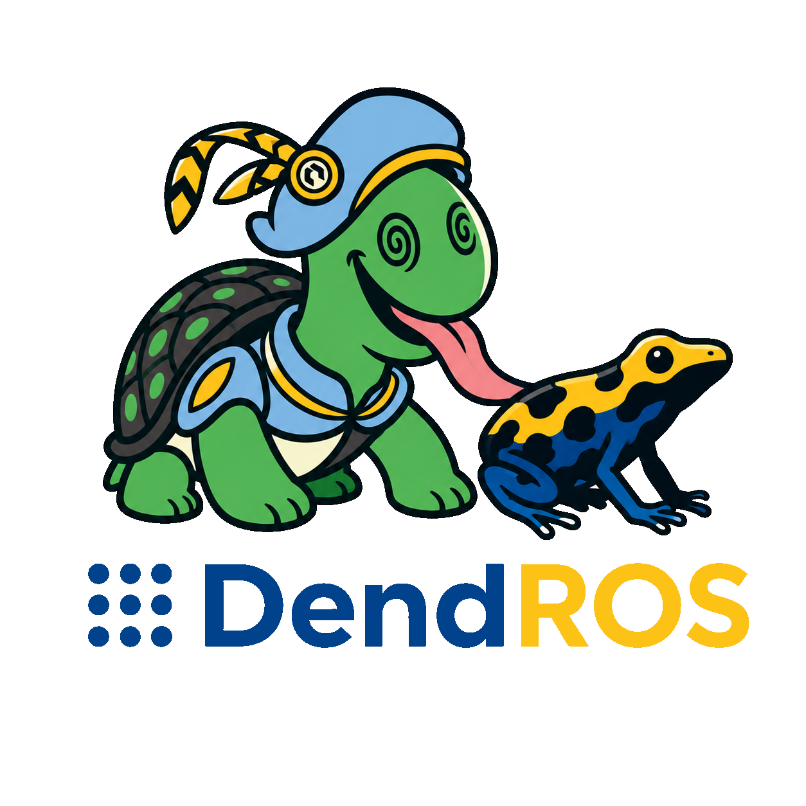
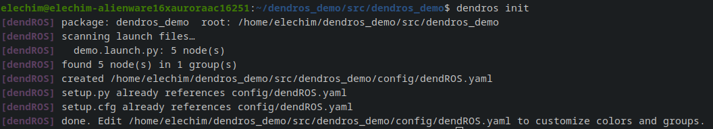
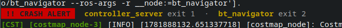
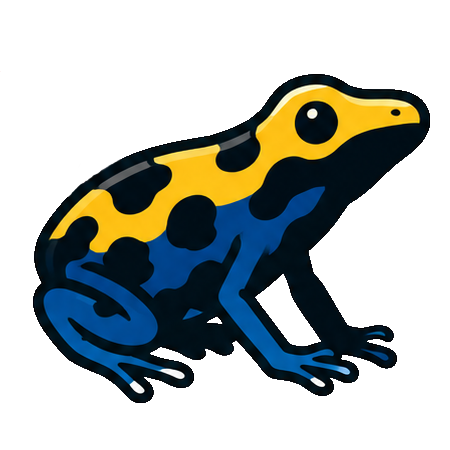
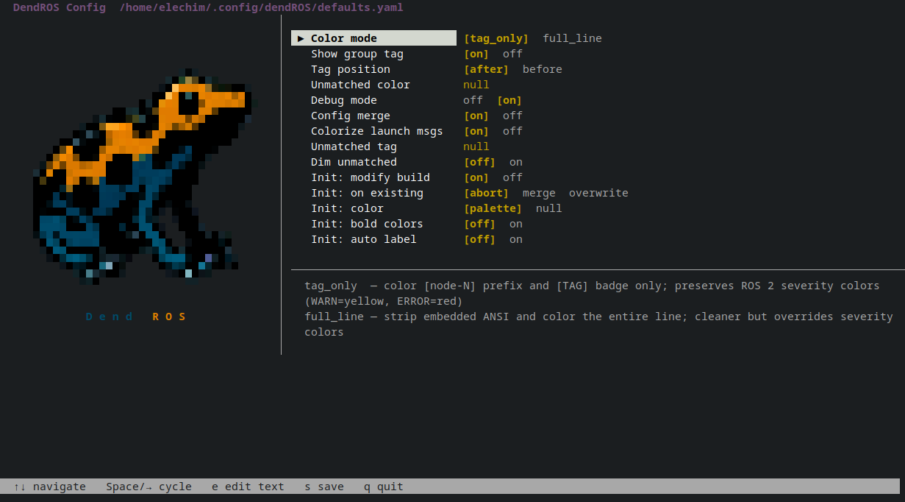

<p align="center">
  
</p>

<h1 align="center">DendROS</h1>
<p align="center"><em>Color-coded ROS 2 output — because a wall of white text from 32 nodes is nobody's debugging tool.</em></p>

<p align="center">
  <a href="https://github.com/mlisi1/DendROS/actions/workflows/ci.yml"></a>
  &nbsp;
  <a href="LICENSE"></a>
  &nbsp;
  
</p>

<p align="center">
  <a href="https://mlisi1.github.io/DendROS"><strong>📖 Documentation</strong></a>
</p>

<br>


You launched your stack. Nav2, SLAM, hardware drivers, your own nodes — all printing to the same terminal,
all the same color. By the time you find the line you were looking for, it has scrolled past.

**DendROS assigns each group of nodes its own color.** You could have localization in blue, navigation in green,
hardware in orange — defined once in a small YAML file that lives inside your package.
No launch file edits. No new ROS 2 dependencies. Packages without a config pass through completely unchanged.
It also features some quality of life improvements for ROS outputs.


<br clear="right"/>


## Features


- ### **Color by group** 
  One config file per package maps node groups to colors, badges, and display rules

<p align="center">

</p>

- ### **One command to get started**
   Too lazy to look up how DendROS config works? We got you covered: `dendros init` scans your launch files and generates an initial config for you

<p align="center">

</p>

- ### **Crash alert** 
  An inline banner flags crashed nodes the moment they die, lists the exit code, and repeats periodically so you don't miss it in fast-scrolling output

<p align="center">

</p>

- ### **Traceback highlighting**
  Python tracebacks are colored automatically: bold red for the header and exception line, dim red for the frames; configurable per session

<p align="center">

</p>

- ### **Truly non-invasive** 
  Shell-level pipe; you won't loose autocompletion or aliases for launch files



- ### **Works everywhere** 
  Host install, Docker, any ROS 2 distribution

## Install

```bash
git clone https://github.com/mlisi1/DendROS
cd DendROS && bash install.sh && source ~/.bashrc
```

## Quick start
Go to your bringup launch file package (or any package containing launch files) and run ```dendros init``` to generate an initial config file listing the nodes called in the launch file. You can use ```--recursive``` (or ```-r```) to include nodes called by nested launch files. 
```bash
cd ~/ros2_ws/src/my_bringup
dendros init          # scan your launch files → write config/dendROS.yaml
```

Edit the colors in the generated config, then build and launch as usual:

```bash
colcon build --packages-select my_bringup
source install/setup.bash
ros2 launch my_bringup main.launch.py
```

## Global settings

If you want to customize the global configs, `dendros config` opens an interactive TUI to tune defaults across all your packages. Use the arrow keys to navigate or to change the selected option. 

<p align="center">
  
</p>


MIT — see [LICENSE](LICENSE).
