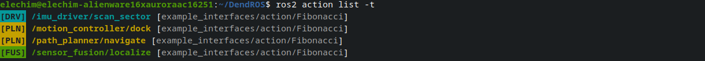

# ros2 action list Colorization

When you run `ros2 action list`, DendROS automatically colorizes the output using the same group colors and badges configured for `ros2 launch`.

---

## What it looks like

<div class="term">
  <div class="term-bar">
    <div class="term-dots">
      <div class="term-dot term-dot-red"></div>
      <div class="term-dot term-dot-yellow"></div>
      <div class="term-dot term-dot-green"></div>
    </div>
    <div class="term-title">ros2 action list</div>
  </div>
  <div class="term-body-image">
  <p align="center">

</p>
</div>
</div>

---

## What gets colored

### Actions under a node namespace

Actions whose path includes a node prefix are colored with that node's group color. For `/bt_navigator/navigate_to_pose`, DendROS looks up `/bt_navigator` in the color map using the same four-tier matching as `ros2 node list` (exact path, basename, wildcard path, wildcard basename).

A group badge is shown to the left of the action path when `show_tag_cli` is enabled and the group has a label.


### Type annotations (`-t`)

Running `ros2 action list -t` appends a type annotation to each entry:

```
/bt_navigator/navigate_to_pose [nav2_msgs/action/NavigateToPose]
```

The type content inside the brackets is always **dimmed**, keeping the focus on the action name.

---

## Badge and style options

| Setting | Effect on action list |
|---|---|
| `show_tag_cli: true` | `[NAV] /bt_navigator/navigate_to_pose` (badge always to the left) |
| `tag_style: inverted` | Badge rendered with colored background |
| Per-group `show_tag: false` | Badge suppressed for that group only |
| `unmatched_color` | Actions with no matching node shown in the fallback color |
| `unmatched_tag` | Badge shown next to unmatched actions (requires `unmatched_color`) |
| `dim_unmatched` | Actions with no matching node dimmed (only when `unmatched_color: null`) |

---
