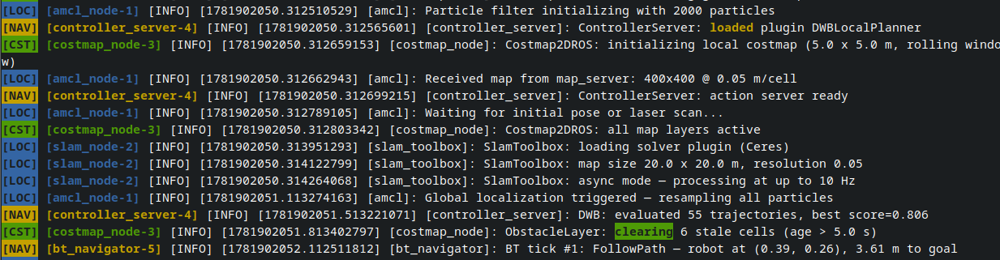

# Config File

Place `dendROS.yaml` inside your package's `config/` directory:

```
my_bringup/
├── config/
│   └── dendROS.yaml
├── launch/
│   └── main.launch.py
└── CMakeLists.txt
```

DendROS discovers the file automatically via `ros2 pkg prefix` or `AMENT_PREFIX_PATH`. No path configuration required.

!!! tip "Let `dendros init` do the scaffolding"
    Running `dendros init` generates this file from your launch files and patches your build system to install it. See [dendros init](dendros-init.md).

---

## Full example

```yaml
groups:

  localization:
    color: "bold blue"
    label: "LOC"
    nodes:
      - slam_toolbox
      - robot_localization
      - "*/amcl"           # matches amcl under any namespace

  navigation:
    color: "bold green"
    label: "NAV"
    nodes:
      - nav2_*             # covers all nav2_* nodes

  hardware:
    color: "#CC8800"
    label: "HW"
    show_tag: false        # suppress badge for this group only
    color_mode: full_line  # per-group: color entire line
    tag_style: inverted    # per-group: colored background, empty letters
    nodes:
      - robot_state_publisher
      - joint_state_publisher

defaults:
  color_mode: "tag_only"
  show_group_tag: true
  tag_position: "after"
  tag_style: "normal"      # normal | inverted
  unmatched_color: null
  unmatched_tag: null
  dim_unmatched: false
  colorize_launch_msgs: true
```

---

## Groups

| Key | Required | Description |
|---|---|---|
| `color` | yes | Color for this group. See [Colors](colors.md). |
| `label` | no | Short badge text shown as `[LOC]`. Empty string = no badge. |
| `nodes` | yes | List of node name patterns. |
| `show_tag` | no | `false` suppresses the badge for this group only. |
| `color_mode` | no | Per-group override: `tag_only` or `full_line`. |
| `tag_style` | no | Per-group override: `normal` (colored text) or `inverted` (colored background). |
| `highlight` | no | List of keyword entries to highlight within this group's lines. See [Keyword highlighting](#keyword-highlighting). |

---

## Node matching

The numeric suffix (`-1`, `-2`) is stripped before matching.

| Pattern | Matches |
|---|---|
| `slam_toolbox` | `[slam_toolbox-1]`, `[slam_toolbox-2]`, … |
| `/my_ns/talker` | only nodes at that exact namespace path |
| `nav2_*` | `nav2_controller`, `nav2_planner`, … |
| `*/amcl` | `/robot/amcl`, `/my_ns/amcl`, … |
| `*controller*` | any node whose basename contains `controller` |
| `node_?` | `node_a`, `node_b`, … |

**Lookup order** (first match wins): exact full-path → exact basename → wildcard full-path → wildcard basename.

---

## Defaults section

| Key | Default | Description |
|---|---|---|
| `color_mode` | `tag_only` | `tag_only` or `full_line`. |
| `show_group_tag` | `true` | Show `[TAG]` badges for this package. |
| `tag_position` | `after` | `after` → `[node-N] [TAG] …` · `before` → `[TAG] [node-N] …`. |
| `tag_style` | `normal` | `normal` (colored text) or `inverted` (colored background, empty letters). |
| `highlight` | `[]` | List of keyword entries applied to all matched nodes in this package. See [Keyword highlighting](#keyword-highlighting). |
| `unmatched_color` | `null` | Color for unmatched nodes. `null` = pass through. |
| `unmatched_tag` | `null` | Badge for unmatched nodes (e.g. `"?"` → `[?]`). Requires `unmatched_color`. |
| `dim_unmatched` | `false` | Dim unmatched nodes. Only when `unmatched_color: null`. |
| `colorize_launch_msgs` | `true` | Colorize `[INFO] [node-N]: process started …` lifecycle lines. |

---

## color_mode

=== "tag_only (default)"

    Colors only the `[node-N]` prefix and `[TAG]` badge.
    ROS 2 severity colors are **preserved** — `[WARN]` stays yellow, `[ERROR]` stays red.

    <div class="term"><div class="term-bar"><div class="term-dots"><div class="term-dot term-dot-red"></div><div class="term-dot term-dot-yellow"></div><div class="term-dot term-dot-green"></div></div><div class="term-title">color_mode: tag_only</div></div><div class="term-body"><span class="t-blue">[slam_toolbox-1]</span> <span class="t-blue t-badge">[LOC]</span> <span class="t-info">[INFO]</span> <span class="t-dim">[1234.1]:</span> map loaded<br><span class="t-green">[controller_server-1]</span> <span class="t-green t-badge">[NAV]</span> <span class="t-warn">[WARN]</span> <span class="t-dim">[1234.2]:</span> Costmap is empty</div></div>

=== "full_line"

    Colors the **entire line** in the group's color. Severity colors are overridden.

    <div class="term"><div class="term-bar"><div class="term-dots"><div class="term-dot term-dot-red"></div><div class="term-dot term-dot-yellow"></div><div class="term-dot term-dot-green"></div></div><div class="term-title">color_mode: full_line</div></div><div class="term-body"><span class="t-blue">[slam_toolbox-1] [LOC] [INFO] [1234.1]: map loaded</span><br><span class="t-green">[controller_server-1] [NAV] [WARN] [1234.2]: Costmap is empty</span></div></div>

Priority order (most specific wins): per-group `color_mode:` → per-package `defaults.color_mode:` → global `dendros config`.

---

## Keyword highlighting

<div class="term">
  <div class="term-bar">
    <div class="term-dots">
      <div class="term-dot term-dot-red"></div>
      <div class="term-dot term-dot-yellow"></div>
      <div class="term-dot term-dot-green"></div>
    </div>
    <div class="term-title">Keyword Highlighting</div>
  </div>
  <div class="term-body-image">
  <p align="center">

</p>
</div>
</div>

The `highlight:` (or also `highlights:`) key can appear under a **group** (applies only to that group's nodes) or under **`defaults:`** (applies to all matched nodes in the package). Keyword highlighting is the final colorization step — it runs after node-prefix coloring, badge insertion, and full-line coloring, so it never disrupts existing ANSI codes.

### Keyword entry fields

| Field | Type | Default | Description |
|---|---|---|---|
| `word` | string | required | Text to match. Treated as a literal string unless `regex: true`. |
| `color` | string | null | Highlight color. Accepts the same formats as `color:` on a group. `null` = use the node/group color. |
| `bold` | bool | false | Apply bold to the highlight (appends `;1` to the resolved code). |
| `inverted` | bool | false | Apply reverse-video to the highlight (colored background, empty letters). |
| `case_sensitive` | bool | false | Match case-sensitively. |
| `regex` | bool | false | Treat `word` as a regex pattern. |

Keyword priority: **group-level** keywords take precedence over **defaults-level** keywords. When multiple keywords match the same text, the first entry in the list wins.

### Example

```yaml
groups:
  localization:
    color: "bold blue"
    label: "LOC"
    highlight:
      - word: "map loaded"      # use group color (bold blue), case-insensitive
        bold: true
      - word: "CRITICAL"
        color: "bold red"
        inverted: true          # colored background, empty letters
      - word: "pos: \\d+\\.\\d+"
        regex: true             # regex pattern
        color: "#FF8800"
    nodes:
      - slam_toolbox

defaults:
  highlight:
    - word: "WARN"              # applies to all matched nodes in this package
      color: "bold yellow"
    - word: "timeout"
      color: "bold red"
```


