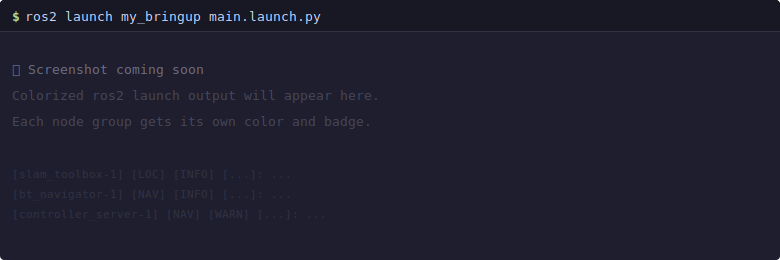

# DendROS

<p align="center">
  
</p>

<p align="center"><strong>Colorized ROS 2 terminal output.</strong></p>

---



DendROS shadows the `ros2` command with a shell function. When you run `ros2 launch` or `ros2 run`, the output is piped through a lightweight Python colorizer that reads a small YAML config from your package, matches the `[node-N]` prefix on each line, and applies group colors. Every other `ros2` subcommand passes through unchanged. Packages without a config are completely unaffected — no changes to launch files, no exit-code clobbering, no buffering.

---

## Features

<div class="feature-grid" markdown>
<div class="feature-card" markdown>
<div class="fc-icon">🎨</div>
<strong>Group-based coloring</strong>
<p>Assign colors to logical groups — localization, navigation, hardware. Every node in a group shares its color and badge label.</p>
</div>
<div class="feature-card" markdown>
<div class="fc-icon">🔍</div>
<strong>Smart node matching</strong>
<p>Exact names, namespaced paths, and <code>fnmatch</code> wildcards. <code>nav2_*</code> covers every Nav2 node in one pattern.</p>
</div>
<div class="feature-card" markdown>
<div class="fc-icon">🔗</div>
<strong>Automatic config merging</strong>
<p>DendROS parses your launch file and merges configs from included packages at runtime. No extra steps.</p>
</div>
<div class="feature-card" markdown>
<div class="fc-icon">🛠️</div>
<strong>Scaffold in one command</strong>
<p><code>dendros init</code> scans your launch files and writes a ready-to-edit <code>dendROS.yaml</code> automatically.</p>
</div>
<div class="feature-card" markdown>
<div class="fc-icon">⚙️</div>
<strong>Interactive config TUI</strong>
<p><code>dendros config</code> opens a curses TUI for managing global defaults — no YAML editing required.</p>
</div>
<div class="feature-card" markdown>
<div class="fc-icon">🚫</div>
<strong>Truly non-invasive</strong>
<p>No launch file changes. Exit codes preserved. <code>DENDROS_DISABLE=1</code> bypasses everything instantly.</p>
</div>
</div>

---

## Quick start

```bash
git clone https://github.com/mlisi1/DendROS
cd DendROS && bash install.sh && source ~/.bashrc
```

```bash
cd ~/ros2_ws/src/my_bringup
dendros init --recursive --labels
```

```bash
colcon build --packages-select my_bringup
source install/setup.bash
ros2 launch my_bringup main.launch.py
```

See [Installation](installation.md) for the full setup or [Quick Start](quickstart.md) for a step-by-step walkthrough.
