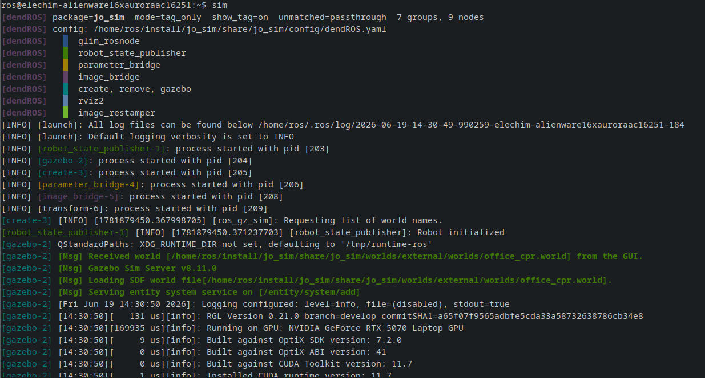

# Installation

## Requirements

- ROS 2 (any distribution)
- Python 3.8+
- `pyyaml` — `pip3 install pyyaml`
- bash shell

---

## Install

=== "Host"

    ```bash
    git clone https://github.com/mlisi1/DendROS
    cd DendROS
    bash install.sh
    source ~/.bashrc
    ```

    The installer copies files to `/usr/local/dendROS/` and adds a `source` line to `~/.bashrc`.
    From that point on, `ros2 launch` and `ros2 run` are automatically piped through the colorizer.

=== "Docker — installer"

    Use the non-interactive `-y` flag for `RUN` layers:

    ```dockerfile
    COPY . /tmp/dendROS/
    RUN bash /tmp/dendROS/install.sh -y
    ```

=== "Docker — manual"

    Copy only the essential runtime files:

    ```dockerfile
    COPY dendROS/ /usr/local/dendROS/
    RUN pip3 install --no-cache-dir pyyaml \
     && chmod +x /usr/local/dendROS/dendROS_pipe.py \
     && printf '\n# dendROS\nsource /usr/local/dendROS/dendROS.sh\n' \
        >> /root/.bashrc
    ```

---

## Docker Compose

Add these settings to your service so colors render correctly:

```yaml
services:
  my_robot:
    tty: true
    stdin_open: true
    environment:
      - RCUTILS_COLORIZED_OUTPUT=1
```

!!! tip "Exec vs Up"
    `docker compose exec my_robot bash` sources `~/.bashrc` immediately.
    `docker compose up` log streaming has no TTY — `tty: true` is required for ANSI colors to render there.

---

## Uninstall

```bash
bash uninstall.sh
```

Removes `/usr/local/dendROS/` and the `.bashrc` lines cleanly. Nothing else is touched.

---

## Verify

After sourcing `.bashrc`, use `DENDROS_DEBUG=1` to confirm DendROS found your config:

```bash
DENDROS_DEBUG=1 ros2 launch my_pkg my_launch.py
```

<div class="term">
  <div class="term-bar">
    <div class="term-dots">
      <div class="term-dot term-dot-red"></div>
      <div class="term-dot term-dot-yellow"></div>
      <div class="term-dot term-dot-green"></div>
    </div>
    <div class="term-title">Colored Terminal Output</div>
  </div>
  <div class="term-body-image">
  <p align="center">

</p>
</div>
</div>

If you see `passthrough mode` instead, the config was not found. Check that:

- The package was built and `install/setup.bash` was sourced.
- `config/dendROS.yaml` is installed to `share/my_bringup/config/` — verify your `CMakeLists.txt` installs the `config/` directory.
