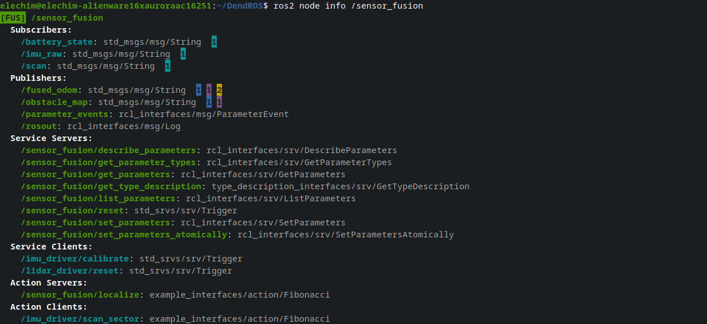

# ros2 node info Colorization

When you run `ros2 node info /node_name`, DendROS automatically colorizes the output using the same group colors configured for `ros2 launch`. No extra setup is required — colors are read from the same cache file the pipe writes during launch.

---

## What it looks like

<div class="term">
  <div class="term-bar">
    <div class="term-dots">
      <div class="term-dot term-dot-red"></div>
      <div class="term-dot term-dot-yellow"></div>
      <div class="term-dot term-dot-green"></div>
    </div>
    <div class="term-title">ros2 node info /costmap_builder</div>
  </div>
  <div class="term-body-image">
  <p align="center">

</p>
</div>
</div>

---

## What gets colored

### Node name

The first line (the node name) is colored with the group color and badge — the same way it appears in `ros2 launch` output.

### Section headers

All section headers (`Subscribers:`, `Publishers:`, `Service Servers:`, …) are rendered **bold**, regardless of whether a config is loaded.

### Type annotations

The message or service type on each entry (`: sensor_msgs/msg/LaserScan` or ` [sensor_msgs/msg/LaserScan]`) is **dimmed** on every line. `(None)` entries are also dimmed and receive no color.

### Output sections

Entries in **Publishers**, **Service Servers**, and **Action Servers** are colored with the **node's own group color** — these are things the node provides to others.

### Input sections

Entries in **Subscribers**, **Service Clients**, and **Action Clients** are colored with the **provider's color** — the color of whichever node publishes, serves, or handles that item:

| Section | Colored with |
|---|---|
| Subscribers | Primary publisher's group color |
| Service Clients | Service server node's group color |
| Action Clients | Action server node's group color |

---

## Group indicators on topics

For **Publishers** and **Subscribers**, DendROS queries the live ROS 2 graph and shows small inverted-color count indicators at the end of each entry — one per distinct group with connected endpoints:

- **Publishers**: indicators show how many **subscribers** are connected per group.
- **Subscribers**: indicators show how many **publishers** are connected per group.

```
  Publishers:
    /costmap: std_msgs/msg/OccupancyGrid  [PLN]2 [MON]1
    /rosout: rcl_interfaces/msg/Log
```

The number inside each colored block is the count of nodes from that group connected to the topic. This gives you an immediate visual overview of who is listening to or publishing each topic.

For **Service Clients** and **Action Clients** with more than one matching server, extra server nodes are shown as trailing colored `■` squares after the type annotation.

---

## Color and tag sources

DendROS uses the same two-stage lookup as `ros2 node list`:

1. **Primary** — `~/.config/dendROS/node_colors.yaml` (written automatically during any `ros2 launch` or `ros2 run`).
2. **Fallback** — scans `AMENT_PREFIX_PATH` for installed `dendROS.yaml` configs.

If no config is found, section headers are still bolded and types dimmed, but no group colors are applied.

---

## Notes

- Both `name: type` (older ROS 2) and `name [type]` (newer ROS 2) entry formats are handled automatically.
- Graph queries use a single rclpy session for all input sections (topics, services, and actions) to minimize overhead and avoid DDS discovery races.
- When `rclpy` is unavailable, services and actions fall back to a name heuristic (`/server_name/service` → `server_name`); topics fall back to `ros2 topic info --verbose` subprocesses.
