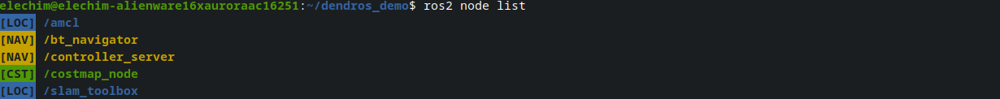

# ros2 node list Colorization

When you run `ros2 node list`, DendROS automatically colorizes the output using the same group colors and badges configured for `ros2 launch`. No extra setup is required — colors are shared across terminals through a small cache file that the pipe writes during launch.

---

## What it looks like

  

    

      

      

      

    

    
ros2 node list

  

  

  

---

### Bidirectional node name discovery

ROS 2 nodes sometimes register a different name in the graph than the launch process name. For example, `slam_toolbox` is launched as `slam_node` (the process name) but registers in the graph as `/slam_toolbox`. DendROS resolves this automatically:

- **Forward**: when a process name (e.g. `slam_node`) is in your config and its log output reveals the graph name (`[slam_toolbox]`), both names are added to the cache.
- **Reverse**: when a graph name (e.g. `slam_toolbox`) is in your config and a line from an unknown process references it, both names are added.

After one launch, `ros2 node list` shows the correct color for `/slam_toolbox` even if your config only lists `slam_node`.

---

## Badge and style options

All badge and color-mode settings from your config and global defaults apply:

| Setting | Effect on node list |
|---|---|
| `show_group_tag: true` | `[LOC] /amcl_node` (badge before or after, per `tag_position`) |
| `tag_position: before` | Badge appears before the node name |
| `tag_position: after` | Badge appears after the node name |
| `tag_style: inverted` | Badge rendered with colored background |
| Per-group `show_tag: false` | Badge suppressed for that group only |
| `unmatched_color` | Unmatched nodes shown in the fallback color |
| `unmatched_tag` | Badge shown next to unmatched nodes (requires `unmatched_color`) |
| `dim_unmatched` | Unmatched nodes dimmed (only when `unmatched_color: null`) |

---

