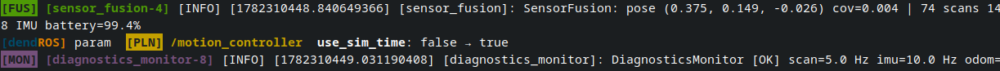
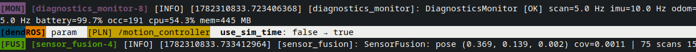

# Parameter Change Alert

When a node's parameter is changed at runtime via `ros2 param set` or any ROS 2 parameter service client, DendROS prints an inline notification in the launch terminal — so you always know when and what changed without leaving the log view.

Enabled by default. Disable with:

```bash
dendros config   # → "Param change alert" → off
```

or in `~/.config/dendROS/defaults.yaml`:

```yaml
param_change_alert: false
```

---

## What it looks like

### Inline

  <div class="term">
    <div class="term-bar">
      <div class="term-dots">
        <div class="term-dot term-dot-red"></div>
        <div class="term-dot term-dot-yellow"></div>
        <div class="term-dot term-dot-green"></div>
      </div>
      <div class="term-title">ros2 launch my_pkg bringup.launch.py</div>
    </div>
    <div class="term-body-image">
    <p align="center">

</p>
</div>
</div>

### Inverted

  <div class="term">
    <div class="term-bar">
      <div class="term-dots">
        <div class="term-dot term-dot-red"></div>
        <div class="term-dot term-dot-yellow"></div>
        <div class="term-dot term-dot-green"></div>
      </div>
      <div class="term-title">ros2 launch my_pkg bringup.launch.py</div>
    </div>
    <div class="term-body-image">
    <p align="center">

</p>
</div>
</div>

---

## Scope

| `param_change_alert_scope` | Behavior |
|---|---|
| `tracked` (default) | Only nodes that appear in a `dendROS.yaml` group generate notifications |
| `all` | Every node on the ROS graph generates notifications, including unmatched nodes |

---

## Alert styles

| `param_change_alert_style` | Appearance |
|---|---|
| `inline` (default) | Compact single line: `[dendROS]` tag + colored node identity + bold param name |
| `inverted` | Full white-background strip from `[dendROS]` to end of line; node identity shown as a colored background island; harder to miss in busy logs |

---

## Configuring via `dendros config`

| TUI field | Values | Description |
|---|---|---|
| **Param change alert** | `on` / `off` | Enable or disable the feature. |
| **Param alert scope** | `tracked` / `all` | Which nodes trigger notifications. |
| **Param alert style** | `inline` / `inverted` | Visual style of the notification line. |

---

## Notes

- Notifications are delayed until the next log line from the launch process arrives (drain is called after each line). If the process is silent, notifications queue up and appear on the next output.
- Transient CLI daemon nodes (`/_ros2cli_*`) are always filtered out regardless of scope.
- Startup parameter declarations (`new_parameters`) are ignored — only `changed_parameters` events generate alerts.
- The background thread terminates automatically when the launch process exits.
- Covers: `ros2 param set`, programmatic `node->set_parameters()`, and any parameter service client that goes through the ROS 2 parameter service.
