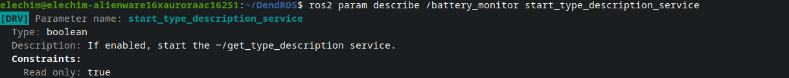

# ros2 param describe Colorization

When you run `ros2 param describe /node param_name`, DendROS colorizes the output: the group badge and param name are highlighted, labels are dimmed so they recede, and section headers like `Constraints:` are rendered bold so the structure is immediately readable.

---

## What it looks like

  

    

      

      

      

    

    
ros2 param describe /battery_monitor start_type_description_service

  

  

  

---

## Badge and style options

| Setting | Effect on param describe |
|---|---|
| `show_tag_cli: true` | Badge shown to the left of the `Parameter name:` line |
| `tag_style: inverted` | Badge rendered with colored background |
| `unmatched_color` | Unmatched node uses the fallback color for the param name |
| `dim_unmatched` | Unmatched param name dimmed (only when `unmatched_color: null`) |

---
