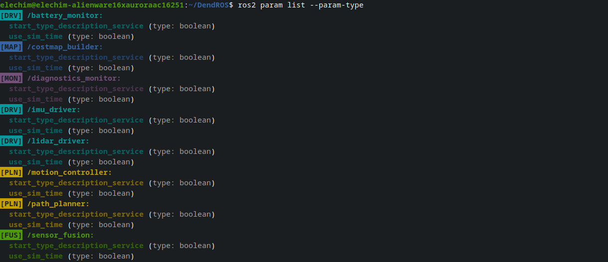

# ros2 param list Colorization

When you run `ros2 param list`, DendROS automatically colorizes node headers with your group colors and badges, and dims the parameter names so the structure is easier to scan at a glance. The `--param-type` flag is fully supported.

---

## What it looks like

  

    

      

      

      

    

    
ros2 param list --param-type

  

  

  

---

## Badge and style options

| Setting | Effect on param list |
|---|---|
| `show_tag_cli: true` | Badge shown to the left of the node header |
| `tag_style: inverted` | Badge rendered with colored background |
| Per-group `show_tag: false` | Badge suppressed for that group only |
| `unmatched_color` | Unmatched node headers shown in the fallback color |
| `unmatched_tag` | Badge shown next to unmatched headers (requires `unmatched_color`) |
| `dim_unmatched` | Unmatched headers dimmed (only when `unmatched_color: null`) |

---

