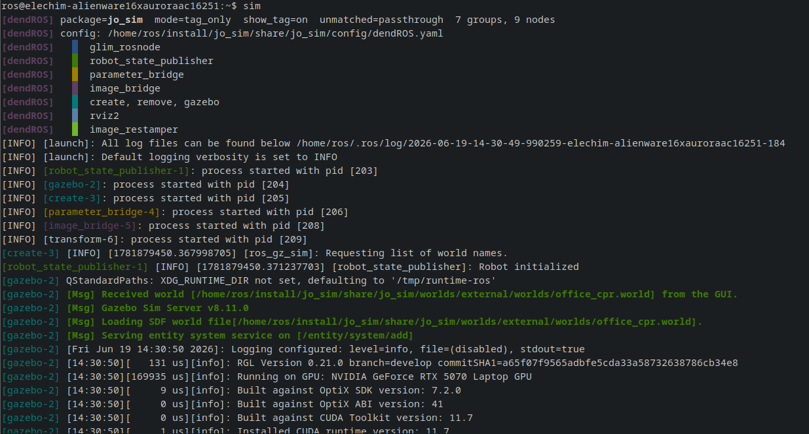

# Quick Start

A complete walkthrough from zero to colorized output.

---

## Step 1 — Install

```bash
git clone https://github.com/mlisi1/DendROS
cd DendROS && bash install.sh && source ~/.bashrc
```

---

## Step 2 — Scaffold a config

Run `dendros init` from inside your bringup package:

```bash
cd ~/ros2_ws/src/my_bringup
dendros init
```

!!! tip "Recursive mode"
    If your launch file includes other packages, use `--recursive` to follow them:
    ```bash
    dendros init --recursive          # follow IncludeLaunchDescription / <include>
    dendros init --recursive --labels # also auto-generate short badge labels
    ```

<div class="term">
  <div class="term-bar">
    <div class="term-dots">
      <div class="term-dot term-dot-red"></div>
      <div class="term-dot term-dot-yellow"></div>
      <div class="term-dot term-dot-green"></div>
    </div>
    <div class="term-title">dendros init --recursive --labels</div>
  </div>
  <div class="term-body"><span class="t-dim">[dendROS] package: my_bringup</span>
<span class="t-dim">[dendROS] scanning (recursive) launch files…</span>
<span class="t-dim">[dendROS]   main.launch.py: 2 node(s)</span>
<span class="t-dim">[dendROS] found references to: nav2_bringup, slam_toolbox</span>
<span class="t-dim">[dendROS]   nav2_bringup/bringup_launch.py [install]: 8 node(s)</span>
<span class="t-dim">[dendROS]   slam_toolbox/online_async_launch.py [source]: 1 node(s)</span>
<span class="t-dim">[dendROS] found 11 node(s) in 3 group(s)</span>
<span class="t-green">[dendROS] created config/dendROS.yaml</span></div>
</div>

---

## Step 3 — Edit the config

Open the generated `config/dendROS.yaml` and set colors and labels:

```yaml
groups:
  nav2_bringup:
    color: "bold green"
    label: "NAV"
    nodes:
      - bt_navigator
      - controller_server
      - planner_server

  slam_toolbox:
    color: "bold blue"
    label: "LOC"
    nodes:
      - slam_toolbox

defaults:
  color_mode: tag_only
  show_group_tag: true
  unmatched_color: null
```

See [Configuration](configuration.md) for the full format and [Colors](colors.md) for all accepted values.

---

## Step 4 — Build and launch

```bash
cd ~/ros2_ws
colcon build --packages-select my_bringup
source install/setup.bash
ros2 launch my_bringup main.launch.py
```

!!! success "Done"
    Your terminal output is now colorized. No other changes to your launch files or ROS 2 setup are needed.

<div class="term">
  <div class="term-bar">
    <div class="term-dots">
      <div class="term-dot term-dot-red"></div>
      <div class="term-dot term-dot-yellow"></div>
      <div class="term-dot term-dot-green"></div>
    </div>
    <div class="term-title">Colored Terminal Output</div>
  </div>
  <div class="term-body-image">
  <p align="center">

</p>
</div>
</div>

If you ever want to turn colorization off, run `dendros disable` (and `dendros enable` to turn it
back on). This takes effect everywhere — every terminal, including a `ros2 launch` that's already
running elsewhere.

!!! note
    For just one shell/invocation instead of system-wide, prefix the command with
    `DENDROS_DISABLE=1` instead:
    ```bash
    DENDROS_DISABLE=1 ros2 launch my_bringup main.launch.py
    ```

??? note "Colors may look different across terminals"
    ROS 2's own log-level colors, and any *standard* named color you use in `dendROS.yaml`
    (`red`, `blue`, `green`, …), are rendered using **your terminal emulator's own color
    theme** — that's how ANSI works, with or without DendROS. The exact same session can
    genuinely look different depending on what you're running it in:

    

    === "Terminator"

        <div class="term">
          <div class="term-bar">
            <div class="term-dots">
              <div class="term-dot term-dot-red"></div>
              <div class="term-dot term-dot-yellow"></div>
              <div class="term-dot term-dot-green"></div>
            </div>
            <div class="term-title">Terminator</div>
          </div>
          <div class="term-body-image">
          <p align="center">
        
        </p>
        </div>
        </div>


    === "Konsole"

        <div class="term">
          <div class="term-bar">
            <div class="term-dots">
              <div class="term-dot term-dot-red"></div>
              <div class="term-dot term-dot-yellow"></div>
              <div class="term-dot term-dot-green"></div>
            </div>
            <div class="term-title">Konsole</div>
          </div>
          <div class="term-body-image">
          <p align="center">
        
        </p>
        </div>
        </div>


    === "Yakuake"
      
        <div class="term">
          <div class="term-bar">
            <div class="term-dots">
              <div class="term-dot term-dot-red"></div>
              <div class="term-dot term-dot-yellow"></div>
              <div class="term-dot term-dot-green"></div>
            </div>
            <div class="term-title">Yakuake</div>
          </div>
          <div class="term-body-image">
          <p align="center">
        
        </p>
        </div>
        </div>

    Use [extended/hex colors](colors.md) (`"#FF6600"`, `teal`, `coral`, …) instead of the 8
    standard names if you want an exact, portable color regardless of terminal theme. See
    [Troubleshooting](#troubleshooting) below for a related but different issue — bold
    colors specifically looking inconsistent between a node's text and its `[TAG]` badge.

---

## Troubleshooting

??? warning "No colors showing"
    Run with debug mode:
    ```bash
    DENDROS_DEBUG=1 ros2 launch my_bringup main.launch.py
    ```
    If you see `passthrough mode`, the config was not discovered. Verify:

    - The package was built and you sourced `install/setup.bash`.
    - `config/dendROS.yaml` is installed. Check `CMakeLists.txt` for:
      ```cmake
      install(DIRECTORY config/ DESTINATION share/${PROJECT_NAME})
      ```

??? warning "Nodes not matching expected colors"
    Check the debug summary — it prints each group and its patterns. Compare against raw output:
    ```bash
    DENDROS_DISABLE=1 ros2 launch my_bringup main.launch.py 2>&1 | grep '^\['
    ```
    Node names are matched after stripping the `-N` suffix. Use wildcards (`nav2_*`) for nodes you don't know in advance.

??? warning "A node's [TAG] badge is a different shade than its own text"
    Some terminals brighten bold *foreground* text but never brighten backgrounds — since a
    node's regular text is bold foreground and its inverted `[TAG]` badge uses that same
    color as a background, the two can end up looking like different shades of the same
    color on terminals that do this. It's a terminal rendering quirk, not a config problem:


    === "Mismatched Colors"
        <div class="term">
          <div class="term-bar">
            <div class="term-dots">
              <div class="term-dot term-dot-red"></div>
              <div class="term-dot term-dot-yellow"></div>
              <div class="term-dot term-dot-green"></div>
            </div>
            <div class="term-title">Before — ignore_bold off (default)</div>
          </div>
          <div class="term-body-image">
          <p align="center">
        
        </p>
        </div>
        </div>

    === "Correct Colors"

        <div class="term">
          <div class="term-bar">
            <div class="term-dots">
              <div class="term-dot term-dot-red"></div>
              <div class="term-dot term-dot-yellow"></div>
              <div class="term-dot term-dot-green"></div>
            </div>
            <div class="term-title">After — ignore_bold on</div>
          </div>
          <div class="term-body-image">
          <p align="center">
        
        </p>
        </div>
        </div>

    Fix it by enabling **Ignore bold** in `dendros config` (Output tab), or setting
    `ignore_bold: true` in `~/.config/dendROS/defaults.yaml` directly. This strips the bold
    modifier everywhere colors are resolved — `ros2 launch`/`run`, the TUI, and every
    `ros2 node/service/action/param/topic` CLI command — so hue stays consistent regardless
    of how your terminal handles bold. See [Global config](global-config.md#output-launch-run).
