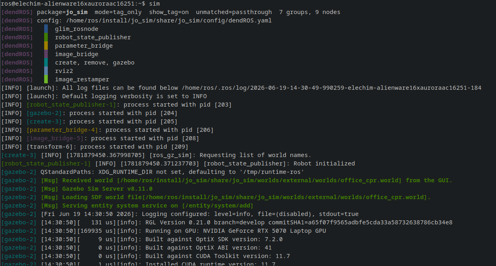

# Quick Start

A complete walkthrough from zero to colorized output.

---

## Step 1 — Install

```bash
git clone https://github.com/mlisi1/DendROS
cd DendROS && bash install.sh && source ~/.bashrc
```

---

## Step 2 — Scaffold a config

Run `dendros init` from inside your bringup package:

```bash
cd ~/ros2_ws/src/my_bringup
dendros init
```

!!! tip "Recursive mode"
    If your launch file includes other packages, use `--recursive` to follow them:
    ```bash
    dendros init --recursive          # follow IncludeLaunchDescription / <include>
    dendros init --recursive --labels # also auto-generate short badge labels
    ```

<div class="term">
  <div class="term-bar">
    <div class="term-dots">
      <div class="term-dot term-dot-red"></div>
      <div class="term-dot term-dot-yellow"></div>
      <div class="term-dot term-dot-green"></div>
    </div>
    <div class="term-title">dendros init --recursive --labels</div>
  </div>
  <div class="term-body"><span class="t-dim">[dendROS] package: my_bringup</span>
<span class="t-dim">[dendROS] scanning (recursive) launch files…</span>
<span class="t-dim">[dendROS]   main.launch.py: 2 node(s)</span>
<span class="t-dim">[dendROS] found references to: nav2_bringup, slam_toolbox</span>
<span class="t-dim">[dendROS]   nav2_bringup/bringup_launch.py [install]: 8 node(s)</span>
<span class="t-dim">[dendROS]   slam_toolbox/online_async_launch.py [source]: 1 node(s)</span>
<span class="t-dim">[dendROS] found 11 node(s) in 3 group(s)</span>
<span class="t-green">[dendROS] created config/dendROS.yaml</span></div>
</div>

---

## Step 3 — Edit the config

Open the generated `config/dendROS.yaml` and set colors and labels:

```yaml
groups:
  nav2_bringup:
    color: "bold green"
    label: "NAV"
    nodes:
      - bt_navigator
      - controller_server
      - planner_server

  slam_toolbox:
    color: "bold blue"
    label: "LOC"
    nodes:
      - slam_toolbox

defaults:
  color_mode: tag_only
  show_group_tag: true
  unmatched_color: null
```

See [Configuration](configuration.md) for the full format and [Colors](colors.md) for all accepted values.

---

## Step 4 — Build and launch

```bash
cd ~/ros2_ws
colcon build --packages-select my_bringup
source install/setup.bash
ros2 launch my_bringup main.launch.py
```

!!! success "Done"
    Your terminal output is now colorized. No other changes to your launch files or ROS 2 setup are needed.

<div class="term">
  <div class="term-bar">
    <div class="term-dots">
      <div class="term-dot term-dot-red"></div>
      <div class="term-dot term-dot-yellow"></div>
      <div class="term-dot term-dot-green"></div>
    </div>
    <div class="term-title">Colored Terminal Output</div>
  </div>
  <div class="term-body-image">
  <p align="center">

</p>
</div>
</div>

---

## Step 5 — Try TUI mode (optional)

For big launches, switch `ros2 launch` to the full-screen viewer, where you can scroll back, search, filter by node or severity, and copy with the mouse:

```bash
dendros config    # Output tab → Launch mode → tui, then s to save
```

Launch again, then press ++backslash++ and type a command:

```text
\focus slam_toolbox
\level warn
```

See [TUI Mode](launch-tui.md) and [Console Commands](tui-console.md).

---

## Turning it off

`dendros disable` turns DendROS off in every terminal, including launches that are already running; `dendros enable` turns it back on. To skip it for a single command, prefix it with `DENDROS_DISABLE=1`. See [Enable & Disable](runtime-control.md).

---

## Next steps

- [Package Config](configuration.md): groups, badges, keyword highlighting
- [Colors](colors.md): every accepted color format
- [Global Settings](global-config.md): defaults for all packages
- [Troubleshooting](troubleshooting.md): no colors, wrong colors, terminal quirks
