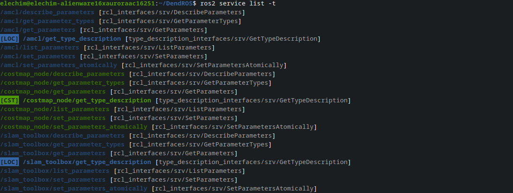

# ros2 service list Colorization

When you run `ros2 service list`, DendROS automatically colorizes the output using the same group colors and badges configured for `ros2 launch`. Standard ROS 2 system services are dimmed so your own services stand out.

---

## What it looks like

<div class="term">
  <div class="term-bar">
    <div class="term-dots">
      <div class="term-dot term-dot-red"></div>
      <div class="term-dot term-dot-yellow"></div>
      <div class="term-dot term-dot-green"></div>
    </div>
    <div class="term-title">ros2 service list</div>
  </div>
  <div class="term-body-image">
  <p align="center">

</p>
</div>
</div>

---

## What gets colored

### Custom services

Services that belong to a node in your config are colored with that node's group color. The owning node is inferred from the service path — for `/talker/my_service`, DendROS looks up `/talker` in the color map using the same four-tier matching as `ros2 node list` (exact path, basename, wildcard path, wildcard basename).

A group badge is shown to the left of the service path when `show_tag_cli` is enabled and the group has a label.

### Default (system) services

Every ROS 2 node automatically creates a set of standard parameter and logger services. These are rendered **dimmed** so they stay visible but don't compete with your own services:

- `describe_parameters`
- `get_parameter_types`
- `get_parameters`
- `list_parameters`
- `set_parameters`
- `set_parameters_atomically`
- `get_loggers`
- `set_logger_levels`
- `get_type_description`

When the owning node has a color configured, the name is dimmed in that color (`node_color + dim`). Otherwise it falls back to plain dim.

!!! note "Hiding default services"
    If you want to declutter the output entirely, set `show_default_services: false` in `~/.config/dendROS/defaults.yaml` (or toggle it in `dendros config`). Default services will be omitted from the output completely.

### Type annotations (`-t`)

Running `ros2 service list -t` appends a type annotation to each entry:

```
/talker/my_service [custom_msgs/srv/MyService]
```

The type content inside the brackets is always **dimmed**, keeping the focus on the service name.

---

## Badge and style options

| Setting | Effect on service list |
|---|---|
| `show_tag_cli: true` | `[LOC] /talker/my_service` (badge always to the left) |
| `tag_style: inverted` | Badge rendered with colored background |
| Per-group `show_tag: false` | Badge suppressed for that group only |
| `unmatched_color` | Services with no matching node shown in the fallback color |
| `unmatched_tag` | Badge shown next to unmatched services (requires `unmatched_color`) |
| `dim_unmatched` | Services with no matching node dimmed (only when `unmatched_color: null`) |
| `show_default_services: false` | Default system services hidden entirely |

---


