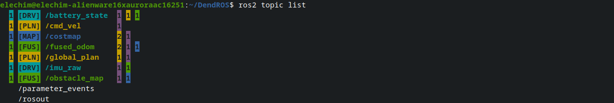
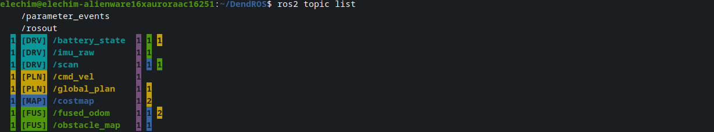

# ros2 topic list Colorization

When you run `ros2 topic list`, DendROS colors each topic with its primary publisher's group color, adds publisher and subscriber count indicators, and supports badge labels — the same colors and config you set up for `ros2 launch`. Running `ros2 topic list -v` gets minimal formatting: bold section headers and dimmed type annotations.

---

## What it looks like

=== "Default sort"

    <div class="term">
      <div class="term-bar">
        <div class="term-dots">
          <div class="term-dot term-dot-red"></div>
          <div class="term-dot term-dot-yellow"></div>
          <div class="term-dot term-dot-green"></div>
        </div>
        <div class="term-title">ros2 topic list</div>
      </div>
      <div class="term-body-image">
      <p align="center">
    
    </p>
    </div>
    </div>

=== "Group sort"

    <div class="term">
      <div class="term-bar">
        <div class="term-dots">
          <div class="term-dot term-dot-red"></div>
          <div class="term-dot term-dot-yellow"></div>
          <div class="term-dot term-dot-green"></div>
        </div>
        <div class="term-title">ros2 topic list</div>
      </div>
      <div class="term-body-image">
      <p align="center">
    
    </p>
    </div>
    </div>

---

## What gets colored

### Topic name

Each topic is colored with the group color of its **primary publisher** — the first publisher node reported by the ROS graph. If that node has a configured group, the topic name is rendered in that color. A group badge is shown to the **left** of the topic name when `show_tag_cli` is enabled and the group has a label.

If a topic has no publishers or its publishers don't match any group, the topic falls back to `unmatched_color` (if set), dim (if `dim_unmatched` is true), or plain white.

### Publisher count blocks

To the **left** of the badge and topic name, DendROS shows one inverted-color count block per publisher group. Each block shows how many publishers of that group color are advertising this topic. Multiple groups produce multiple adjacent blocks. The blocks are right-aligned across all topics so names stay in a consistent column regardless of how many groups are publishing.

### Subscriber count blocks

To the **right** of the topic name (and type annotation if `-t` is used), DendROS shows subscriber count blocks using the same inverted-color format. Subscriber blocks are left-aligned across all topics so they start at a consistent column.

### System topics

`/parameter_events` and `/rosout` are always shown plain — no color, no badge, no count blocks. They are excluded from the graph query entirely. Their names are still aligned to the same column as other topics.

### Type annotations (`-t`)

Running `ros2 topic list -t` appends a type annotation to each entry:

```
/chatter [std_msgs/msg/String]
```

The type content inside the brackets is always **dimmed**, keeping focus on the topic name. Subscriber count blocks appear to the right of the type annotation.

---

## Verbose mode (`-v`)

Running `ros2 topic list -v` produces a structured output with `Published topics:` and `Subscribed topics:` sections. DendROS detects this format automatically and applies minimal formatting:

- **Section headers** (`Published topics:`, `Subscribed topics:`) are rendered **bold**
- **Type annotations** inside `[...]` are **dimmed**
- Topic names, bullet points, and publisher/subscriber counts are left unchanged

No group color coding is applied in verbose mode — the structured format already groups topics by role.

---

## Sorting (`topic_sort`)

By default, topics appear in the order `ros2` reports them (alphabetical).

Setting `topic_sort: group` reorders topics:

1. **System topics first** — `/parameter_events` and `/rosout` always appear at the top
2. **Matched topics grouped by color** — groups appear in first-occurrence order; topics are alphabetical within each group
3. **Unmatched topics last** — alphabetical

Empty lines from the original output are dropped in group sort mode.

```yaml
# ~/.config/dendROS/defaults.yaml
topic_sort: group   # default | group
```

---

## Badge and style options

| Setting | Effect on topic list |
|---|---|
| `show_tag_cli: true` | `[LOC] /topic_name` — badge always to the left of the topic name |
| `tag_style: inverted` | Badge rendered with colored background |
| Per-group `show_tag: false` | Badge suppressed for that group only |
| `unmatched_color` | Topics with no matching publisher group shown in the fallback color |
| `unmatched_tag` | Badge shown next to unmatched topics (requires `unmatched_color`) |
| `dim_unmatched` | Topics with no matching publisher group dimmed (only when `unmatched_color: null`) |
| `topic_sort` | `default` = ros2 order (alphabetical); `group` = system first, then by publisher group |

