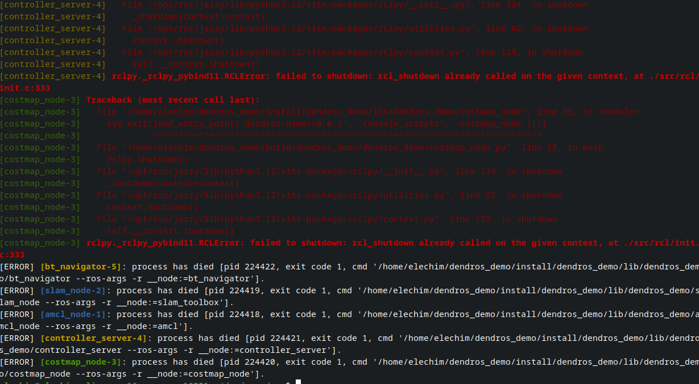

# Traceback Highlighting

DendROS automatically detects Python tracebacks in ROS 2 output and applies distinct colors to make them stand out from the surrounding log noise.

This is configured via `traceback_color` in `~/.config/dendROS/defaults.yaml` (or via `dendros config`):

```yaml
traceback_color: fancy   # fancy | red | off
```

---

## What it looks like

<div class="term">
  <div class="term-bar">
    <div class="term-dots">
      <div class="term-dot term-dot-red"></div>
      <div class="term-dot term-dot-yellow"></div>
      <div class="term-dot term-dot-green"></div>
    </div>
    <div class="term-title">Traceback Highlighting</div>
  </div>
  <div class="term-body-image">
  <p align="center">

</p>
</div>
</div>

---

## Modes

=== "fancy (default)"

    **Header and exception lines** are shown in bold red.
    **Frame lines** (the indented `File …, line …, in …` / code lines) are shown in dim red.

    This makes it immediately clear which line is the key error vs. which lines are context frames.

    ```yaml
    traceback_color: fancy
    ```

=== "red"

    The entire traceback block — header, frames, and exception line — is shown in bold red.

    Good for high-noise terminals where you want a visually loud, uniform color.

    ```yaml
    traceback_color: red
    ```

=== "off"

    Tracebacks pass through without any color applied. Node-prefixed lines still receive their standard node colorization.

    ```yaml
    traceback_color: off
    ```

---

## Node-prefixed tracebacks

ROS 2 launch prefixes each output line with the node name, including traceback lines:

```
[my_node-1] Traceback (most recent call last):
[my_node-1]   File "/opt/ros/humble/lib/my_pkg/my_node.py", line 42, in run
[my_node-1]     result = some_function()
[my_node-1] ValueError: something went wrong
```

DendROS handles this correctly:

- The `[my_node-1]` prefix is kept but **dimmed** (a darker version of the node's group color).
- The traceback content after the prefix is colored according to the selected mode.

This preserves node identification while making the traceback structure visually clear.

---

## Configuring via `dendros config`

The setting is exposed in the TUI under **System**:

| Setting | Values |
|---|---|
| **Traceback color** | `fancy` / `red` / `off` |

---

## Notes

- Segmentation faults (`Segmentation fault (core dumped)`) and other C-level signal output are **not** treated as Python tracebacks and pass through unchanged.
- ROS 2 shutdown tracebacks triggered by `Ctrl-C` are captured and colorized — the pipe drains all remaining output before exiting.
- The `off` mode is a strict passthrough: no state machine is entered, so there is zero overhead and zero risk of misidentification.
